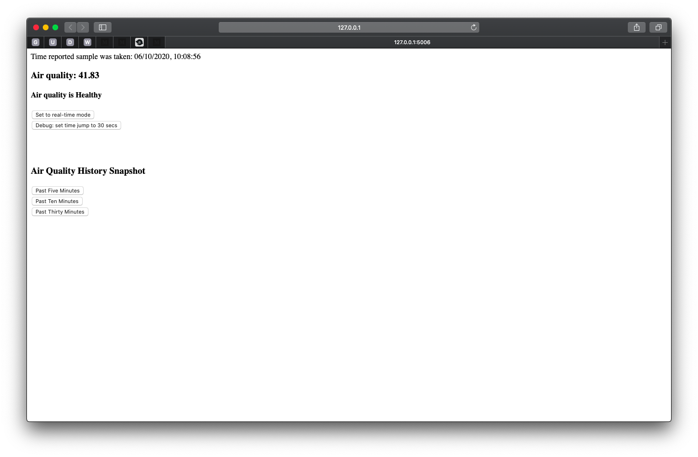
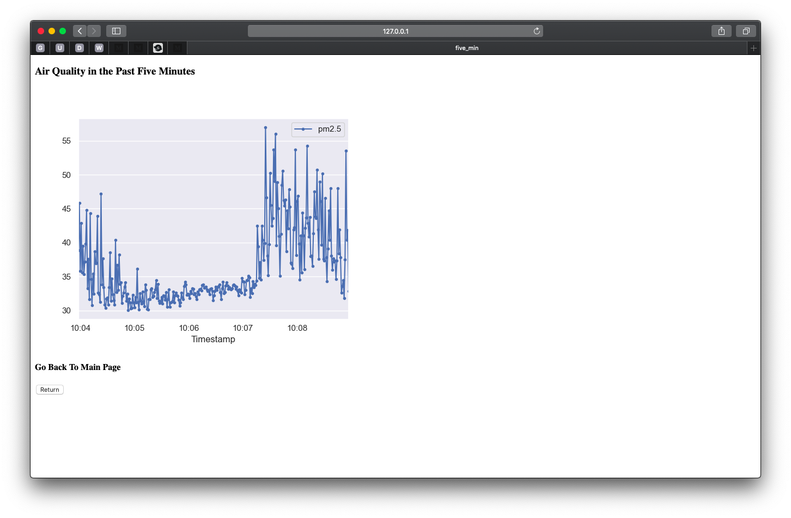
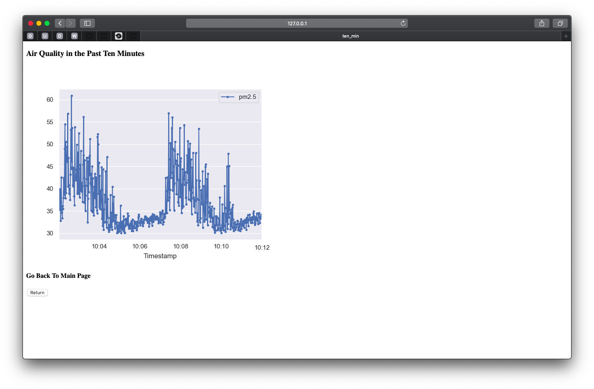
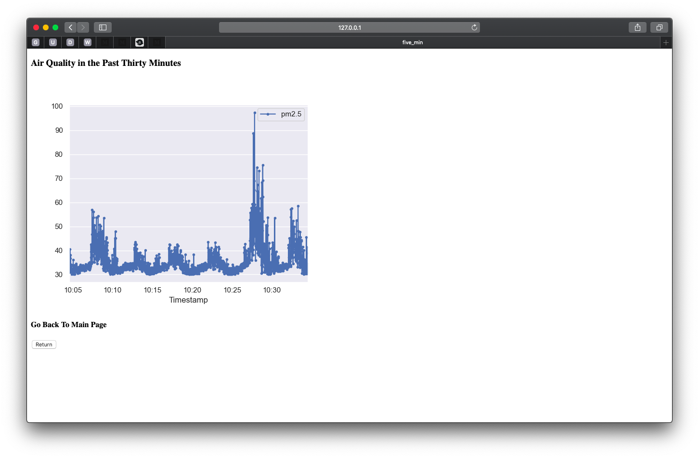

# Air-Quality-Monitor User's Guide

1. main.py: imports from the fuctions and the simulator, runs the flask server.
2. functions.py: uses a simple package (called package) that can be downlaoded via GitHub.
3. simulator.py: uses a simple package (called package) that can be downlaoded via GitHub.

## Requirements

The list of requirements listed below are for the Air-Quality-Monitor app. 

- appnope >= 0.1.0 # version must be at least 0.1.0  
- astroid >= 2.4.1 # version must be at least 2.4.1  
- backcall >= 0.1.0 # version must be at least 0.1.0  
- click >= 7.1.2 # version must be at least 7.1.2  
- cycler >= 0.10.0 # version must be at least 0.10.0  
- decorator >= 4.4.2 # version must be at least 4.4.2  
- Flask >= 1.1.2 # version must be at least 1.1.1  
- ipykernel >= 5.3.0 # version must be at least 5.3.0  
- ipython >= 7.14.0 # version must be at least 7.14.0  
- ipython-genutils >= 0.2.0 # version must be at least 0.2.0  
- isort >= 4.3.21 # version must be at least 4.3.21  
- itsdangerous >= 1.1.0 # version must be at least 1.1.0  
- jedi >= 0.17.0 # version must be at least 0.17.0  
- Jinja2 >= 2.11.2 # version must be at least 2.11.2  
- jupyter-client >= 6.1.3 # version must be at least 6.1.3  
- jupyter-core >= 4.6.3 # version must be at least 4.6.3  
- kiwisolver >= 1.2.0 # version must be at least 1.2.0  
- lazy-object-proxy >= 1.4.3 # version must be at least 1.4.3  
- MarkupSafe >= 1.1.1 # version must be at least 1.1.1  
- matplotlib >= 3.2.1 # version must be at least 3.2.1  
- mccabe >= 0.6.1 # version must be at least 0.6.1  
- numpy >= 1.18.5 # version must be at least 1.18.5  
- pandas >= 1.0.4 # version must be at least 1.0.4  
- parso >= 0.7.0 # version must be at least 0.7.0  
- pexpect >= 4.8.0 # version must be at least 4.8.0  
- pickleshare >= 0.7.5 # version must be at least 0.7.5  
- pip >= 20.1.1 # version must be at least 20.1.1  
- prompt-toolkit >= 3.0.5 # version must be at least 3.0.5  
- ptyprocess >= 0.6.0 # version must be at least 0.6.0  
- Pygments >= 2.6.1 # version must be at least 2.6.1  
- pylint >= 2.5.2 # version must be at least 2.5.2  
- pyparsing >= 2.4.7 # version must be at least 2.4.7  
- pysqlite3 >= 0.4.3 # version must be at least 0.4.3  
- python-dateutil >= 2.8.1 # version must be at least 2.8.1  
- pytz >= 2020.1 # version must be at least 2020.1  
- pyzmq >= 19.0.1 # version must be at least 19.0.1  
- scipy >= 1.5.0 # version must be at least 1.5.0  
- seaborn >= 0.10.1 # version must be at least 0.10.1  
- setuptools >= 41.2.0 # version must be at least 41.2.0  
- six >= 1.15.0 # version must be at least 1.15.0  
- toml >= 0.10.1 # version must be at least 0.10.1  
- tornado >= 6.0.4 # version must be at least 6.0.4  
- traitlets >= 4.3.3 # version must be at least 4.3.3  
- typed-ast >= 1.4.1 # version must be at least 1.4.1  
- wcwidth >= 0.1.9 # version must be at least 0.1.9  
- Werkzeug >= 1.0.1 # version must be at least 1.0.1  
- wrapt >= 1.12.1 # version must be at least 1.12.1  
- yagmail >= 0.11.224 # version must be at least 0.11.224  

## Installation

for main.py
- Use pip to install the required third party packages: 'pip -r requirements.txt'
  
for run_package.py
- Use pip to build and install package as a local package and install required packages
- Open a OS terminal, go into the project root folder and type: pip install . (<- dot!)

## Usage

- main.py: run it in the project root folder, so it can import from the packages folder
- run_packages.py: can be run from any folder once it's been installed locally

## Code Examples

#use the get_index_of_most_recent_timestamp funtion
from package import get_index_of_most_recent_timestamp  
tup = np.where(datetime_array < datetime_obj)  
index_array = tup[0]  
idx = index_array[-1]  
return idx  

#use the get_curr_value funtion 
from package import get_curr_value  
t_arr = df['Timestamp']  
v_arr = df['pm2.5']  
get_index_of_most_recent_timestamp_timestamp = get_index_of_most_recent_timestamp(t_arr, current_time)  
idx = get_index_of_most_recent_timestamp_timestamp  
most_recent_timestamp = t_arr[idx]  
most_recent_value = v_arr[idx]  
return most_recent_timestamp, most_recent_value  

#use the current_quality funtion 
from package import current_quality  
if indicator_value < 50:  
    return "Healthy"  
elif 50 <= indicator_value < 150:  
    return "Moderate"  
else:  
    return "Unhealthy"  

#use the generate_simulated_data funtion 
from simulator import generate_simulated_data  
curr_t = datetime.datetime(year, month, date, clock, minute, second, milisecond)  
tstamps = []  
for t in time:  
tdelta = datetime.timedelta(seconds=1)  
curr_t = curr_t + tdelta  
tstamps.append(curr_t)  
df['Timestamp'] = tstamps  
return df  

#use the get_past_X_min funtion in main.py  
time_in_past = current_time - datetime.timedelta(minutes=min)  
print("getting data for time from", time_in_past, 'to', curr_time)  
return df[(df['Timestamp'] > time_in_past) & (df['Timestamp'] <= current_time)]  

# Know Issues 

- The simulated data only runs for an hour, starting at 06/10/2020 10:00:06.
- User input feature allows user to input the preferred email address to receive the alerts. However since it runs on Flask, user has to input the email address twice. 

# Ackonwledgments 
  
- simulates data generation in the format of a wave https://stackoverflow.com/questions/14058340/adding-noise-to-a-signal-in-python
- sending emails with python https://realpython.com/python-send-email/
  
# Screenshots 

* current air quality

* past five minutes of air quality

* past five minutes of air quality

* past five minutes of air quality
